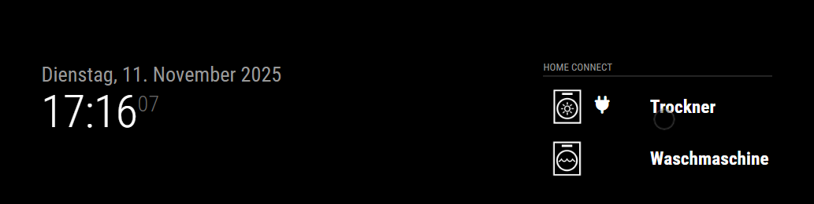
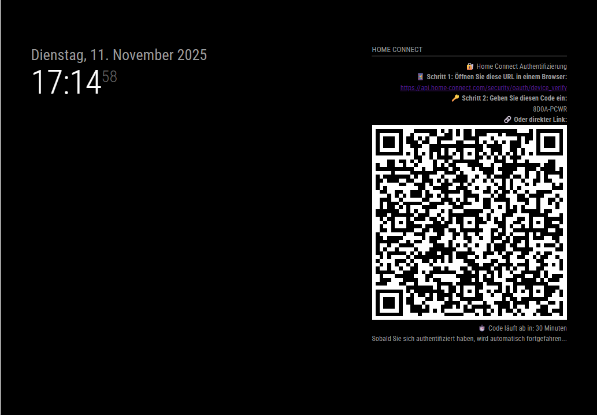

# MMM-HomeConnect2 (Headless Device Flow)

This module connects MagicMirror to BSH (Bosch, Siemens, Neff, Gaggenau, ...) devices. It uses the OAuth2 Device Flow so a browser is not required on the MagicMirror server.

### Overview / Appliance Status


Key features
- Headless Device Flow authentication (no local browser needed)
- On-screen instructions and code for user authentication
- Token storage and automatic refresh
- Basic rate limiting and error handling

Quick install

```bash
cd ~/MagicMirror/modules
git clone https://github.com/djerik/MMM-HomeConnect2
cd MMM-HomeConnect2
npm install
```

- You need to have a registred Home Connect Account with eMail and password with connected Home Connect devices.
- You also need to register for a Home Connect Developer Account [Home Connect Registration](https://developer.home-connect.com/user/register).
- You also need to register an Application in the developer portal to get a Client ID
- a Client Secret is not needed for headless authentication.

Simple config example (add to your MagicMirror `config/config.js`):

```js
{
    module: "MMM-HomeConnect2",
    position: "top_left",
    config: {
        client_ID: "YOUR_CLIENT_ID",
        client_Secret: "YOUR_CLIENT_SECRET",
        use_headless_auth: true,
        showDeviceIcon: true,
        updateFrequency: 60 * 60 * 1000 // 1 hour
    }
}
```


### Authentication / Device Flow


How authentication works
- First time: module shows a URL and a short code on the MagicMirror screen.
- Open that URL on any device, enter the code and grant access.
- The module saves tokens locally and uses them to call the API.

If the token expires, the module will automatically refresh it when possible.

Troubleshooting
- If you see "polling too quickly" errors, wait a minute and try again.
- Check logs with `pm2 logs mm` or in your terminal.
- Token file: `modules/MMM-HomeConnect2/refresh_token.json` (do not commit this file).

Security
- Keep `client_Secret` and `refresh_token.json` private. Do not commit them to git.

Developer notes
- API endpoints used: device_authorization, token, and homeappliances endpoints of Home Connect.
- Minimum polling interval: 5 seconds. Module adapts if server returns slow_down.

Comparison to the original
--------------------------

This repository is a fork of the original project by djerik (https://github.com/djerik/MMM-HomeConnect2). It is created with respect for the original work and builds on the same goal — integrating Home Connect devices into MagicMirror — while making a few deliberate changes to better suit common headless deployments and to improve maintainability.

Key differences and rationale (this fork vs. djerik/MMM-HomeConnect2):

- Headless-first (Device Flow) instead of browser fallback
- This fork treats the OAuth2 Device Flow (headless) as the primary authentication method. That means there is no built-in Express server or automatic opening of a local browser. The aim is to make the module work reliably on display-less systems (Raspberry Pi, servers).
- Benefit: more reliable operation on pure headless devices and fewer additional services/ports required.
- Trade-off: there is no automatic browser-based OAuth fallback — if you prefer that flow you need to provide a refresh token manually or use a different setup.

- QR code support for the Device Flow
- Instead of sending only a URL, the module generates an QR code and sends it to the frontend UI so users can scan the verification URL with a phone and open it directly.
- Benefit: convenient authentication on mobile devices.

- Reduced / simplified dependencies
- Dependencies such as `express` and `open`, which were used for browser-based flows, were removed. The dependency footprint is smaller and better suited to headless environments.

- More robust token/error handling and logging
- Improved polling logic, slower backoff handling on `slow_down`, clearer error messages and refresh-token storage/updates.
- The code now reports more helpful error messages (HTTP status + truncated response body) to make debugging easier.


Design choices / why these changes
- The changes aim to provide a better experience on typical MagicMirror installs (headless Raspberry Pi) and make authentication easier via smartphone (QR code).

When you might prefer the original
- If you prefer an integrated browser-based OAuth experience (automatic opening of a local browser) or require strict 1:1 look&feel with the original project, the original repository may be the better choice.

Credits
- Many thanks to djerik for the original module — core ideas and structure come from that project.