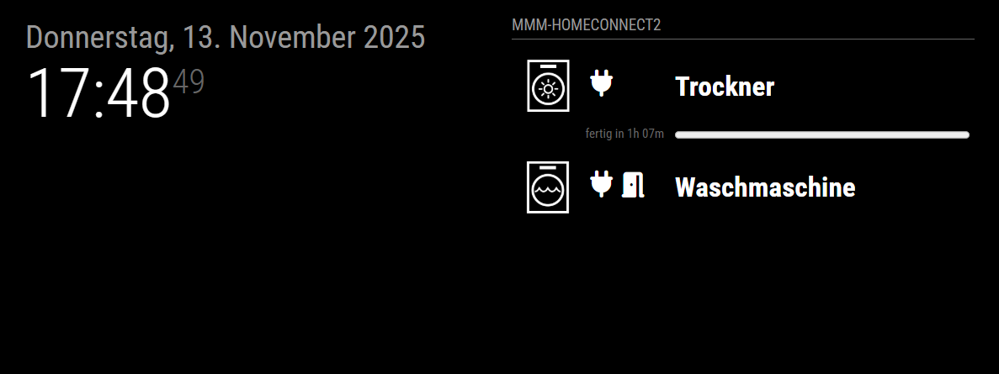
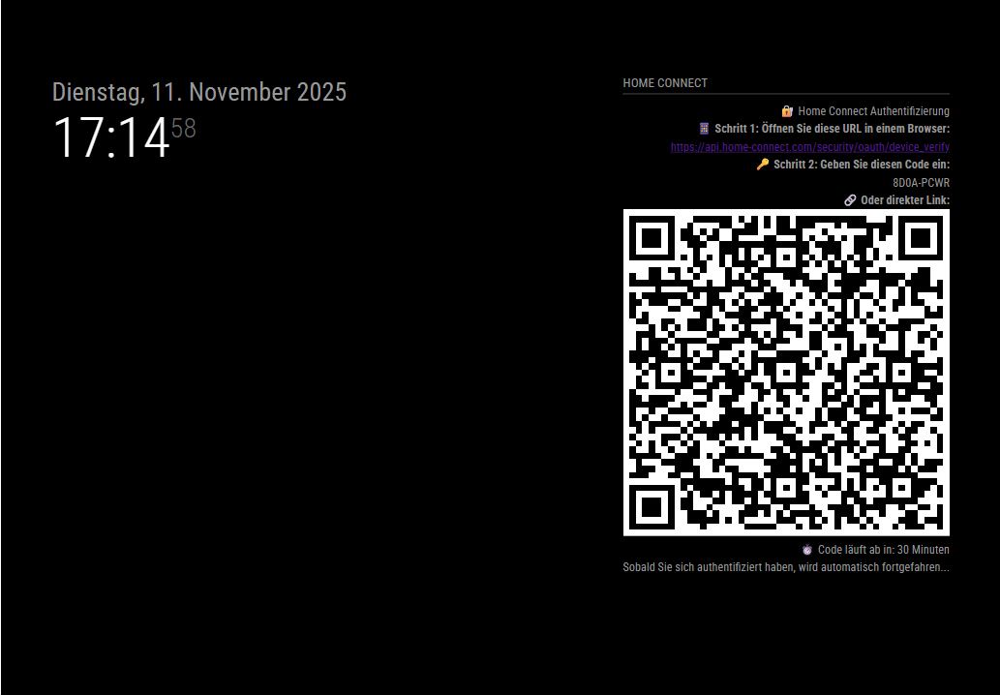

# MMM-HomeConnect2 (Headless Device Flow)

This module connects MagicMirror to BSH (Bosch, Siemens, Neff, Gaggenau, ...) devices. It uses the OAuth2 Device Flow so a browser is not required on the MagicMirror server.

## Overview


## Features
- Headless Device Flow authentication (no local browser needed)
- On-screen instructions and code for user authentication
- Token storage and automatic refresh
- Basic rate limiting and error handling

## Installation

```bash
cd ~/MagicMirror/modules
git clone https://github.com/HeikoGr/MMM-HomeConnect2
cd MMM-HomeConnect2
npm install
```

## Update

```bash
cd ~/MagicMirror/modules/MMM-HomeConnect2
git pull
npm install
```

## Requirements

- You need to have a registered Home Connect account with email and password and connected Home Connect devices.
- You also need to register for a Home Connect Developer Account [Home Connect Registration](https://developer.home-connect.com/user/register).
- You also need to register an application in the developer portal to get a Client ID.
- A client secret is optional for this headless flow. If your Home Connect application provides one, you can still configure it.

## Configuration

Simple config example for your MagicMirror `config/config.js`:

```js
{
    module: "MMM-HomeConnect2",
    position: "top_left",
    config: {
        clientId: "YOUR_CLIENT_ID",
        apiLanguage: "en",
        showDeviceIcon: true,
        showDeviceIfInfoIsAvailable: true,
        progressRefreshIntervalMs: 30 * 1000,
        minActiveProgramIntervalMs: 10 * 60 * 1000
    }
},
```

Common module options
- apiLanguage: Preferred Home Connect API language. Examples: en, de, da, en-GB.
- showDeviceIfInfoIsAvailable: Also display devices when program or status information is available even if the device is otherwise idle.
- showAlwaysAllDevices: Always render all appliances, even when they are currently idle.
- progressRefreshIntervalMs: Frontend-only refresh interval for countdown/progress rendering.
- minActiveProgramIntervalMs: Backend throttle for active-program snapshot requests.
- logLevel: Module log verbosity: none, error, warn, info, debug.

Display behavior
- By default the module focuses on appliances with meaningful state such as active programs, failures, open doors, lighting, or other available program/status data.
- Set showAlwaysAllDevices to true if you prefer a static list of all appliances.
- Set logLevel to debug to show the built-in debug panel and progress-source diagnostics in the frontend.

Typical frontend states
- Running appliances show their current program, remaining time, and a progress indicator.
- Appliances with a selected program can still be shown when showDeviceIfInfoIsAvailable is enabled.
- Authentication, loading, empty-state, and debug-panel views are covered by the frontend render tests.

### Authentication / Device Flow


How authentication works:
- First time: module shows a URL and a short code on the MagicMirror screen.
- Open that URL on any device, enter the code and grant access.
- The module saves tokens locally and uses them to call the API.

If the token expires, the module will automatically refresh it when possible.

Troubleshooting
- If you see "polling too quickly" errors, wait a minute and try again.
- Check logs with `pm2 logs mm` or in your terminal.
- Token file: `MMM-HomeConnect2/refresh_token.json` in the module directory (do not commit this file).

Testing
- `npm test` runs the deterministic unit test suite.
- The unit test suite includes backend helpers and frontend render coverage for typical device and auth states.
- The optional live smoke test is disabled by default.
- To enable it, run `HC_RUN_LIVE_SMOKE_TEST=1 npm test`.
- For the live smoke test you can optionally provide `HC_CLIENT_ID` and `HC_CLIENT_SECRET`. If `HC_CLIENT_ID` is missing, the runner tries to read the MagicMirror config.

Security
- Keep `clientSecret` and `refresh_token.json` private. Do not commit them to git.

Developer notes
- API endpoints used: device_authorization, token, and homeappliances endpoints of Home Connect.
- Minimum polling interval: 5 seconds. Module adapts if server returns slow_down.

## Architecture Contract (API Truth vs. Session FSM)

This module follows a strict separation of responsibilities:

- API truth is authoritative: Device/program fields from Home Connect API and SSE always win and overwrite local values.
- Session FSM is orchestration only: The state machine controls auth/init/rate-limit/retry/error flow, not appliance truth.
- No reverse coupling: FSM transitions must never modify device/program domain values.
- One-way data flow for appliance truth: API/SSE -> service mapping -> shared device store -> frontend rendering.
- Frontend does not infer alternate truth: UI renders API-backed device data plus optional FSM/debug metadata.

Scope boundaries
- FSM scope includes: boot, authenticating, initializing, ready, rate_limited, error, plus technical refresh states.
- FSM scope excludes: PowerState, ActiveProgramName, RemainingProgramTime, ProgramProgress, and other appliance fields.

Review checklist for changes
- Does this change alter appliance data without an API/SSE payload? If yes, reject.
- Does this change add FSM logic that writes device/program fields? If yes, reject.
- Does this change keep orchestration decisions (when to fetch/auth/retry) inside the helper/session FSM? If no, refactor.
- Do tests still cover both dimensions: FSM transitions and API-data overwrite behavior? If no, add tests.

## Documentation

Additional development and devcontainer documentation is collected in [docs/README.md](docs/README.md).

## Comparison to the original

This fork is based on djerik's [MMM-HomeConnect](https://github.com/djerik/MMM-HomeConnect).

**Main differences:**
- **Device Flow only** — no built-in Express server or browser-based OAuth fallback; optimized for headless environments
- **QR code authentication** — scan the URL directly with your phone
- **Reduced dependencies** — removed `express` and `open` packages
- **Improved error handling** — better logging and token refresh logic

**When to use the original:** If you prefer automatic browser-based OAuth or need the exact original implementation.

**Credits:** Many thanks to djerik for the original module.