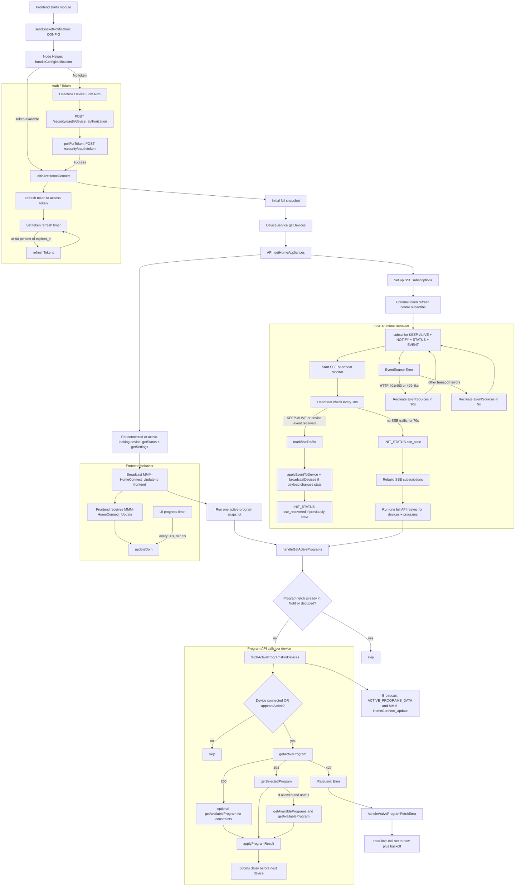
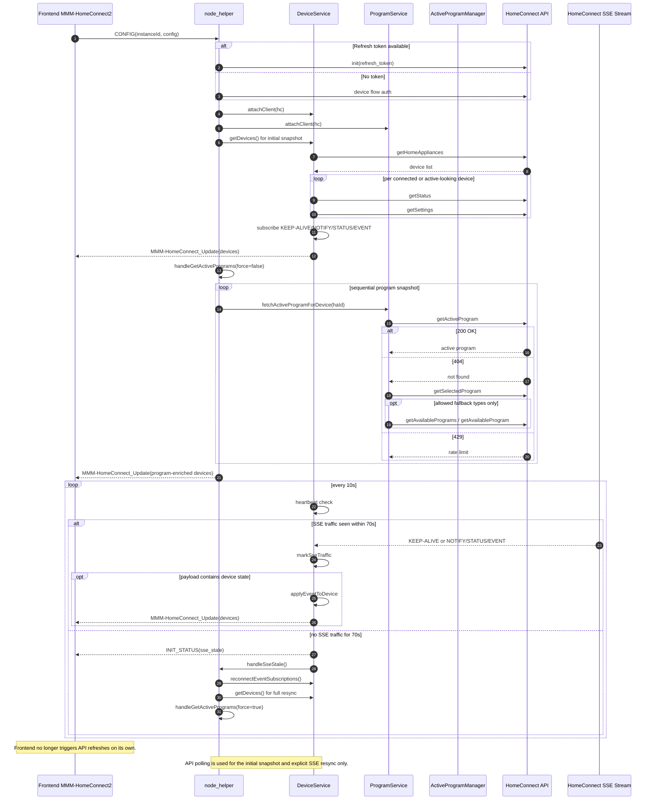

# API Call And Event Flow Diagrams

This document describes the current request and SSE flow of the module.

## Diagram 1: Overall Flow as Flowchart

```mermaid
flowchart TD
  A[Frontend starts module] --> B[sendSocketNotification: CONFIG]
  B --> C[Node Helper: handleConfigNotification]

  C -->|Token available| D[initializeHomeConnect]
  C -->|No token| E[Headless Device Flow Auth]

  subgraph AUTH[Auth / Token]
    E --> E1[POST /security/oauth/device_authorization]
    E1 --> E2[pollForToken: POST /security/oauth/token]
    E2 -->|success| D
    D --> D1[refresh token to access token]
    D1 --> D2[Set token refresh timer]
    D2 -->|at 90 percent of expires_in| D3[refreshTokens]
    D3 --> D2
  end

  D --> F[Initial full snapshot]
  F --> G[DeviceService getDevices]
  G --> G1[API: getHomeAppliances]
  G1 --> G2[Per connected or active-looking device: getStatus + getSettings]
  G2 --> G3[Broadcast MMM-HomeConnect_Update to frontend]
  G3 --> G4[Run one active-program snapshot]

  G1 --> H[Set up SSE subscriptions]
  H --> H0[Optional token refresh before subscribe]
  H0 --> H1[subscribe KEEP-ALIVE + NOTIFY + STATUS + EVENT]
  H1 --> H2[Start SSE heartbeat monitor]

  subgraph SSE[SSE Runtime Behavior]
    H2 --> H3[Heartbeat check every 10s]
    H3 -->|KEEP-ALIVE or device event received| H4[markSseTraffic]
    H4 --> H5[applyEventToDevice + broadcastDevices if payload changes state]
    H5 --> H6[INIT_STATUS sse_recovered if previously stale]

    H3 -->|no SSE traffic for 70s| H7[INIT_STATUS sse_stale]
    H7 --> H8[Rebuild SSE subscriptions]
    H8 --> H9[Run one full API resync for devices + programs]

    H1 --> H10[EventSource Error]
    H10 -->|HTTP 401/403 or 429-like| H11[Recreate EventSources in 30s]
    H10 -->|other transport errors| H12[Recreate EventSources in 5s]
    H11 --> H1
    H12 --> H1
  end

  subgraph FE[Frontend behavior]
    G3 --> I[Frontend receives MMM-HomeConnect_Update]
    I --> I1[updateDom]
    I2[UI progress timer] -->|every 30s, min 5s| I1
  end

  G4 --> O[handleGetActivePrograms]
  H9 --> O

  O --> O0{Program fetch already in flight or deduped?}
  O0 -->|yes| O1[skip]
  O0 -->|no| O2[fetchActiveProgramsForDevices]

  subgraph PROGRAMS[Program API calls per device]
    O2 --> P1{Device connected OR appearsActive?}
    P1 -->|no| P2[skip]
    P1 -->|yes| P3[getActiveProgram]
    P3 -->|200| P4[optional getAvailableProgram for constraints]
    P3 -->|404| P5[getSelectedProgram]
    P5 -->|if allowed and useful| P6[getAvailablePrograms and getAvailableProgram]
    P3 -->|429| P7[RateLimit Error]
    P4 --> P8[applyProgramResult]
    P5 --> P8
    P6 --> P8
    P8 --> P9[500ms delay before next device]
  end

  O2 --> Q[Broadcast ACTIVE_PROGRAMS_DATA and MMM-HomeConnect_Update]
  P7 --> R[handleActiveProgramFetchError]
  R --> R1[rateLimitUntil set to now plus backoff]
```

## Diagram 2: Sequence Diagram

```mermaid
sequenceDiagram
  autonumber
  participant FE as Frontend MMM-HomeConnect2
  participant NH as node_helper
  participant DS as DeviceService
  participant PS as ProgramService
  participant APM as ActiveProgramManager
  participant HC as HomeConnect API
  participant SSE as HomeConnect SSE Stream

  FE->>NH: CONFIG(instanceId, config)

  alt Refresh token available
    NH->>HC: init(refresh_token)
  else No token
    NH->>HC: device flow auth
  end

  NH->>DS: attachClient(hc)
  NH->>PS: attachClient(hc)
  NH->>DS: getDevices() for initial snapshot

  DS->>HC: getHomeAppliances
  HC-->>DS: device list
  loop per connected or active-looking device
    DS->>HC: getStatus
    DS->>HC: getSettings
  end
  DS->>DS: subscribe KEEP-ALIVE/NOTIFY/STATUS/EVENT
  DS-->>FE: MMM-HomeConnect_Update(devices)
  NH->>NH: handleGetActivePrograms(force=false)

  loop sequential program snapshot
    NH->>PS: fetchActiveProgramForDevice(haId)
    PS->>HC: getActiveProgram
    alt 200 OK
      HC-->>PS: active program
    else 404
      HC-->>PS: not found
      PS->>HC: getSelectedProgram
      opt allowed fallback types only
        PS->>HC: getAvailablePrograms / getAvailableProgram
      end
    else 429
      HC-->>PS: rate limit
    end
  end
  NH-->>FE: MMM-HomeConnect_Update(program-enriched devices)

  loop every 10s
    DS->>DS: heartbeat check
    alt SSE traffic seen within 70s
      SSE-->>DS: KEEP-ALIVE or NOTIFY/STATUS/EVENT
      DS->>DS: markSseTraffic
      opt payload contains device state
        DS->>DS: applyEventToDevice
        DS-->>FE: MMM-HomeConnect_Update(devices)
      end
    else no SSE traffic for 70s
      DS-->>FE: INIT_STATUS(sse_stale)
      DS->>NH: handleSseStale()
      NH->>DS: reconnectEventSubscriptions()
      NH->>DS: getDevices() for full resync
      NH->>NH: handleGetActivePrograms(force=true)
    end
  end

  Note over FE: Frontend no longer triggers API refreshes on its own.
  Note over NH,DS: API polling is used for the initial snapshot and explicit SSE resync only.
```
