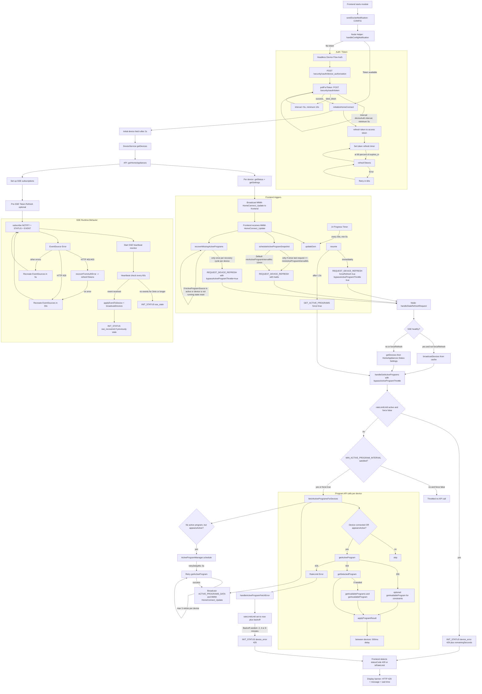

# API Call And Event Flow Diagrams

This document collects the Mermaid diagrams created so far for the question:
When are which Home Connect API calls executed, and how are events processed.

## Diagram 1: Overall Flow as Flowchart

## Diagram 2: Sequence Diagram

