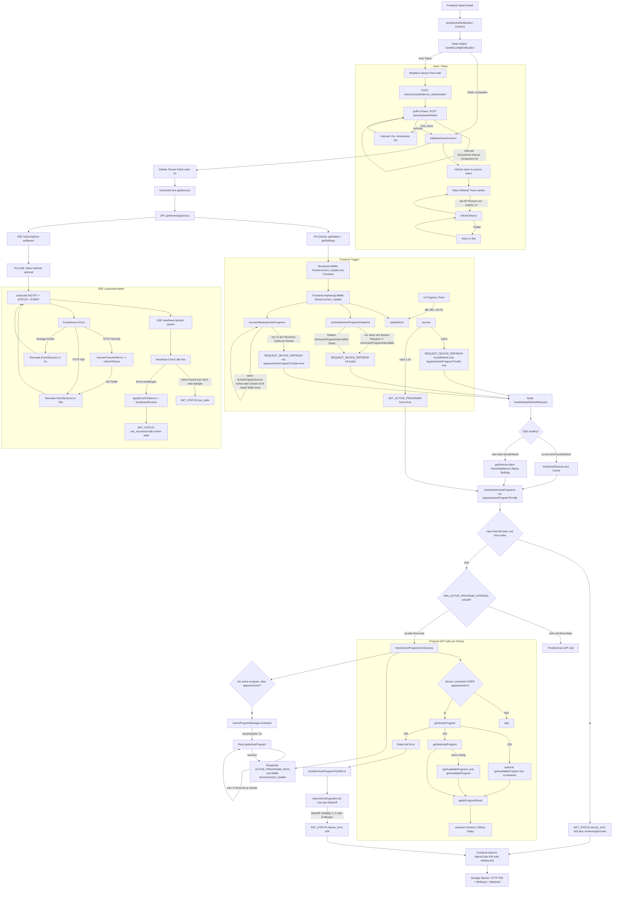

# API Call And Event Flow Diagrams

Dieses Dokument sammelt die bisher erstellten Mermaid-Diagramme zur Frage:
Wann werden welche Home-Connect-API-Calls ausgefuehrt und wie werden Events verarbeitet.

## Diagramm 1: Gesamtfluss als Flowchart

## Diagramm 2: Sequence Diagram

```mermaid
sequenceDiagram
  autonumber
  participant FE as Frontend MMM-HomeConnect2
  participant NH as node_helper
  participant DS as DeviceService
  participant PS as ProgramService
  participant APM as ActiveProgramManager
  participant HC as HomeConnect API
  participant SSE as HomeConnect SSE Stream

  Note over FE: Start
  FE->>NH: CONFIG(instanceId, config)
  NH->>NH: updateActiveProgramInterval()\nDefault: 10 min

  alt Refresh-Token vorhanden
    NH->>HC: init(refresh_token)
  else Kein Token
    NH->>HC: POST /security/oauth/device_authorization
    loop Device-Flow Polling (min 5s Intervall)
      NH->>HC: POST /security/oauth/token
      alt authorization_pending
        HC-->>NH: warten
      else slow_down
        HC-->>NH: Intervall erhoehen (+5s, min 10s)
      else success
        HC-->>NH: access_token + refresh_token
      end
    end
  end

  Note over NH,HC: Nach erfolgreicher Init
  NH->>DS: attachClient(hc)
  NH->>PS: attachClient(hc)
  NH->>DS: getDevices() (initial nach ~2s)

  DS->>HC: getHomeAppliances
  HC-->>DS: Geraete-Liste
  loop pro Geraet (wenn connected oder appearsActive)
    DS->>HC: getStatus
    DS->>HC: getSettings
  end
  DS->>DS: subscribe NOTIFY/STATUS/EVENT
  DS-->>FE: MMM-HomeConnect_Update(devices)

  Note over DS,SSE: SSE-Heartbeat
  loop alle 60s (default)
    DS->>DS: heartbeat check
    alt >=3 min keine Events
      DS-->>FE: INIT_STATUS(sse_stale)
    else Event empfangen
      SSE-->>DS: event payload
      DS->>DS: applyEventToDevice + recordSseEvent
      DS-->>FE: MMM-HomeConnect_Update(devices)
      DS-->>FE: INIT_STATUS(sse_recovered) (falls vorher stale)
    end
  end

  Note over FE: UI-Timer
  loop progressRefreshIntervalMs (default 30s, min 5s)
    FE->>FE: updateDom()
  end

  Note over FE: Bei MMM-HomeConnect_Update
  FE->>FE: recoverMissingActivePrograms()
  alt fehlende ActiveProgram-Daten und laufend
    FE->>NH: REQUEST_DEVICE_REFRESH(haIds, bypassActiveProgramThrottle=true)\n(max 1x pro Recovery-Zyklus je Geraet)
  end

  FE->>FE: scheduleActiveProgramSnapshot()
  alt seit letztem Request >= minActiveProgramIntervalMs (default 10 min)
    FE->>NH: REQUEST_DEVICE_REFRESH(haIds)
  end

  Note over NH: REQUEST_DEVICE_REFRESH verarbeitet
  NH->>NH: sseHealthy? subscribed && !heartbeatStale && hasDevices
  alt forceRefresh oder SSE ungesund
    NH->>DS: getDevices() -> HomeAppliances/Status/Settings
  else SSE gesund
    NH->>DS: broadcastDevices() aus Cache
  end
  NH->>NH: handleGetActivePrograms(force=bypassActiveProgramThrottle)

  alt rateLimitUntil aktiv und force=false
    NH-->>FE: INIT_STATUS(device_error, 429, remainingSeconds)
  else Throttle aktiv (MIN_ACTIVE_PROGRAM_INTERVAL)
    NH->>NH: kein Program-API-Call
  else ActiveProgram-Call erlaubt
    NH->>NH: fetchActiveProgramsForDevices()
    loop pro Zielgeraet (sequentiell)
      alt connected oder appearsActive
        NH->>PS: fetchActiveProgramForDevice(haId)
        PS->>HC: getActiveProgram
        alt 200 OK
          HC-->>PS: active program
          opt Constraints laden
            PS->>HC: getAvailableProgram(programKey)\n(Cache pro haId+programKey)
            HC-->>PS: program definition
          end
        else 404
          HC-->>PS: not found
          PS->>HC: getSelectedProgram
          alt selected vorhanden
            HC-->>PS: selected program
            opt Constraints laden (gecached)
              PS->>HC: getAvailableProgram(programKey)
              HC-->>PS: program definition
            end
          else fallback erlaubt (nicht fuer blockierte Typen)
            PS->>HC: getAvailablePrograms
            HC-->>PS: available list
            PS->>HC: getAvailableProgram(firstProgramKey)
            HC-->>PS: program definition
          end
        else 429
          HC-->>PS: rate limit
          PS->>PS: throw 429
        end
        Note over NH: 500ms Delay zwischen Geraeten
      else skip Geraet
        NH->>NH: no call
      end
    end

    alt Ergebnisse vorhanden
      NH->>PS: applyProgramResult()
      NH-->>FE: MMM-HomeConnect_Update
      NH-->>FE: ACTIVE_PROGRAMS_DATA
    end

    alt No active program aber appearsActive
      NH->>APM: schedule retry\nDelay 5s, max 3 Versuche
      loop Retry
        APM->>PS: fetchActiveProgramForDevice
        PS->>HC: getActiveProgram
      end
    end
  end

  alt 429 in Program-Flow
    PS->>PS: rateLimitUntil = now + backoff
    Note over PS: backoff zufaellig: 2 / 4 / 8 min
    PS-->>FE: INIT_STATUS(device_error, statusCode=429, isRateLimit=true)
    FE->>FE: Banner HTTP 429 anzeigen
  end

  Note over HC: Token-Refresh-Zyklus
  loop bei ~90% token lifetime
    HC->>HC: refreshTokens()
    alt Erfolg
      HC->>HC: recreateEventSources()
    else Fehler
      HC->>HC: Retry nach 60s
    end
  end

  Note over SSE,HC: EventSource Fehlerbehandlung
  alt 401/403
    HC->>HC: auth recovery + refreshTokens
    HC->>HC: recreate in 30s (authDelayMs)
  else 429
    HC->>HC: recreate in 30s (authDelayMs)
  else sonstige Fehler
    HC->>HC: recreate in 5s (baseDelayMs)
  end

  Note over FE: resume()
  FE->>NH: REQUEST_DEVICE_REFRESH(forceRefresh=true, bypassActiveProgramThrottle=true)
  FE->>NH: GET_ACTIVE_PROGRAMS(force=true) nach 1.5s
```

