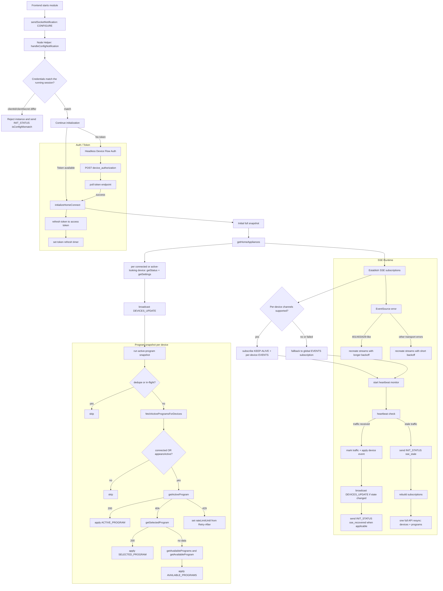
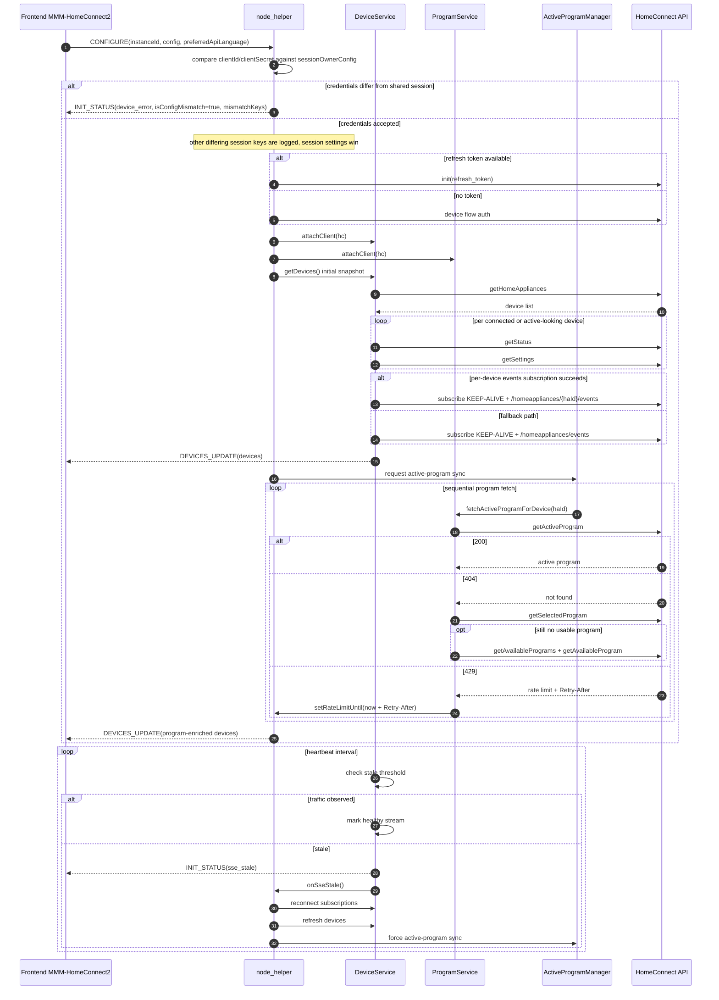

# API Call And Event Flow Diagrams

This document describes the current request, admission, and SSE flow of the module.

## Diagram 1: Overall Flow

```mermaid
flowchart TD
  A[Frontend starts module] --> B[sendSocketNotification: CONFIGURE]
  B --> C[Node Helper: handleConfigNotification]

  C --> C0{Credentials match the running session?}
  C0 -->|"clientId/clientSecret differ"| C1[Reject instance and send INIT_STATUS isConfigMismatch]
  C0 -->|match| D[Continue initialization]

  D -->|Token available| E[initializeHomeConnect]
  D -->|No token| F[Headless Device Flow Auth]

  subgraph AUTH[Auth / Token]
    F --> F1[POST device_authorization]
    F1 --> F2[poll token endpoint]
    F2 -->|success| E
    E --> E1[refresh token to access token]
    E1 --> E2[set token refresh timer]
  end

  E --> G[Initial full snapshot]
  G --> G1[getHomeAppliances]
  G1 --> G2[per connected or active-looking device: getStatus + getSettings]
  G2 --> G3[broadcast DEVICES_UPDATE]
  G3 --> G4[run active-program snapshot]

  G1 --> H[Establish SSE subscriptions]
  H --> H0{Per-device channels supported?}
  H0 -->|yes| H1[subscribe KEEP-ALIVE + per-device EVENTS]
  H0 -->|no or failed| H2[fallback to global EVENTS subscription]
  H1 --> H3[start heartbeat monitor]
  H2 --> H3

  subgraph SSE[SSE Runtime]
    H3 --> I1[heartbeat check]
    I1 -->|traffic received| I2[mark traffic + apply device event]
    I2 --> I3[broadcast DEVICES_UPDATE if state changed]
    I3 --> I4[send INIT_STATUS sse_recovered when applicable]

    I1 -->|stale traffic| I5[send INIT_STATUS sse_stale]
    I5 --> I6[rebuild subscriptions]
    I6 --> I7[one full API resync: devices + programs]

    H --> I8[EventSource error]
    I8 -->|401/403/429-like| I9[recreate streams with longer backoff]
    I8 -->|other transport errors| I10[recreate streams with short backoff]
  end

  subgraph PROGRAMS[Program snapshot per device]
    G4 --> P0{dedupe or in-flight?}
    P0 -->|yes| P1[skip]
    P0 -->|no| P2[fetchActiveProgramsForDevices]

    P2 --> P3{connected OR appearsActive?}
    P3 -->|no| P4[skip]
    P3 -->|yes| P5[getActiveProgram]
    P5 -->|200| P6[apply ACTIVE_PROGRAM]
    P5 -->|404| P7[getSelectedProgram]
    P7 -->|200| P8[apply SELECTED_PROGRAM]
    P7 -->|no data| P9[getAvailablePrograms and getAvailableProgram]
    P9 --> P10[apply AVAILABLE_PROGRAMS]
    P5 -->|429| P11[set rateLimitUntil from Retry-After]
  end
```

## Diagram 2: Sequence Diagram

```mermaid
sequenceDiagram
  autonumber
  participant FE as Frontend MMM-HomeConnect2
  participant NH as node_helper
  participant DS as DeviceService
  participant PS as ProgramService
  participant APM as ActiveProgramManager
  participant HC as HomeConnect API

  FE->>NH: CONFIGURE(instanceId, config, preferredApiLanguage)
  NH->>NH: compare clientId/clientSecret against sessionOwnerConfig

  alt credentials differ from shared session
    NH-->>FE: INIT_STATUS(device_error, isConfigMismatch=true, mismatchKeys)
  else credentials accepted
    Note over NH: other differing session keys are logged, session settings win
    alt refresh token available
      NH->>HC: init(refresh_token)
    else no token
      NH->>HC: device flow auth
    end

    NH->>DS: attachClient(hc)
    NH->>PS: attachClient(hc)
    NH->>DS: getDevices() initial snapshot

    DS->>HC: getHomeAppliances
    HC-->>DS: device list
    loop per connected or active-looking device
      DS->>HC: getStatus
      DS->>HC: getSettings
    end

    alt per-device events subscription succeeds
      DS->>HC: subscribe KEEP-ALIVE + /homeappliances/{haId}/events
    else fallback path
      DS->>HC: subscribe KEEP-ALIVE + /homeappliances/events
    end

    DS-->>FE: DEVICES_UPDATE(devices)
    NH->>APM: request active-program sync

    loop sequential program fetch
      APM->>PS: fetchActiveProgramForDevice(haId)
      PS->>HC: getActiveProgram
      alt 200
        HC-->>PS: active program
      else 404
        HC-->>PS: not found
        PS->>HC: getSelectedProgram
        opt still no usable program
          PS->>HC: getAvailablePrograms + getAvailableProgram
        end
      else 429
        HC-->>PS: rate limit + Retry-After
        PS->>NH: setRateLimitUntil(now + Retry-After)
      end
    end

    NH-->>FE: DEVICES_UPDATE(program-enriched devices)
  end

  loop heartbeat interval
    DS->>DS: check stale threshold
    alt traffic observed
      DS->>DS: mark healthy stream
    else stale
      DS-->>FE: INIT_STATUS(sse_stale)
      DS->>NH: onSseStale()
      NH->>DS: reconnect subscriptions
      NH->>DS: refresh devices
      NH->>APM: force active-program sync
    end
  end
```

## Notes

- The frontend only renders backend-provided state; it does not trigger standalone API refresh loops.
- Program label semantics are explicit: ACTIVE_PROGRAM, SELECTED_PROGRAM, and AVAILABLE_PROGRAMS.
- Rate-limit handling uses server metadata (`Retry-After`) when available.
